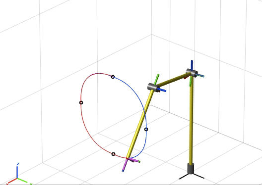
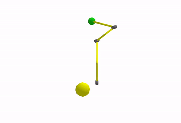

# RobotControlAlgorithms
Various robot control algorithms for 3DoF manipulator: from Gravity Compensation to Force Control. Dynamical properties of the simulated robot are identical to the PUMA 560 surgical manipulator.

Conventional control approach - Passivity Based Robust Control, tracks desired trajectory 
in the presence of parametric uncertainty:

  

Reinforcement Learning control example:

 

The following control algorithms are implemented in this project:  
  
Regulation problem:  
- [x] PD control
- [x] PD control with gravity compensation  

Tracking problem:  
- [x] inverse dynamics control
- [x] Robust control
- [x] Adaptive Inverse Dynamics control
- [x] Lyapunov (Passivity) based tracking control
- [x] Lyapunov based Robust control
- [x] Lyapunov based Adaptive control

Interaction problem:
- [x] impedance control•
- [x] parallel control
- [x] hybrid motion force control
- [x] hybrid impedance velocity control
- [x] hybrid impedance force control

